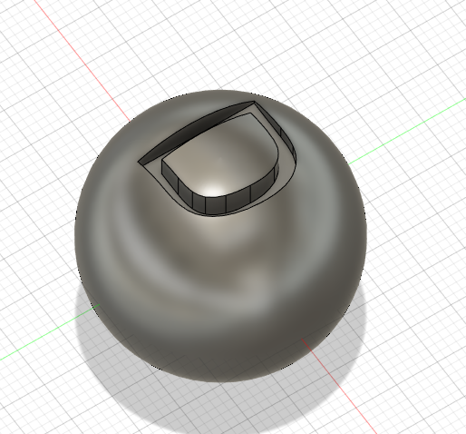
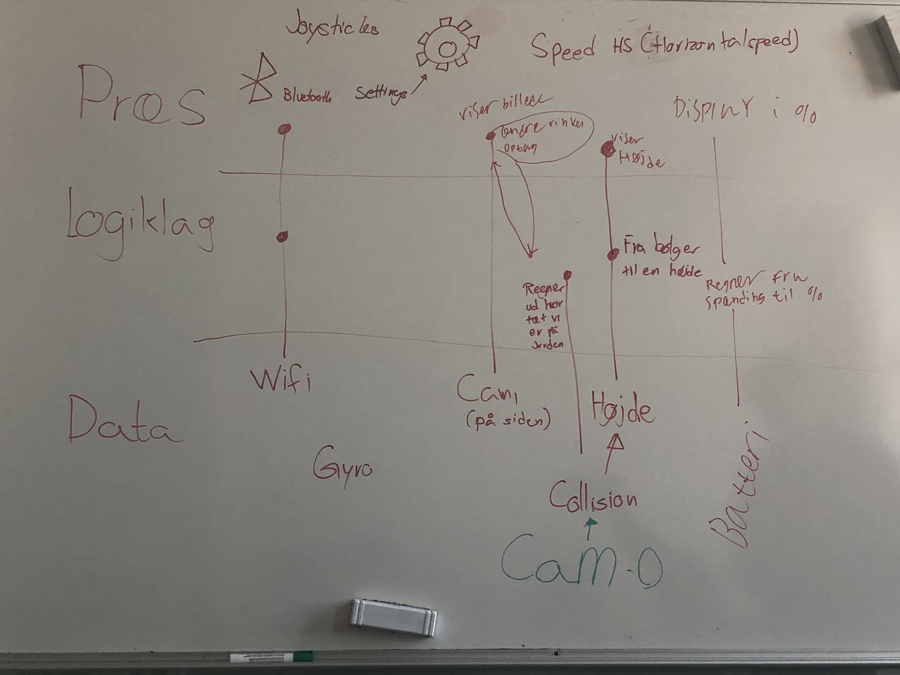
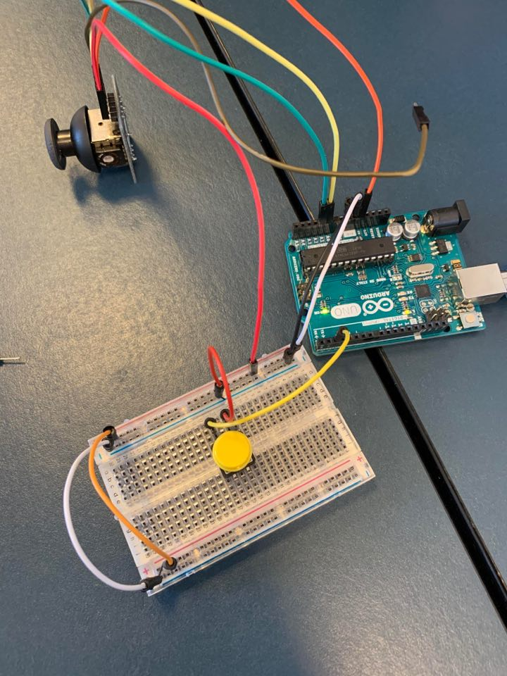
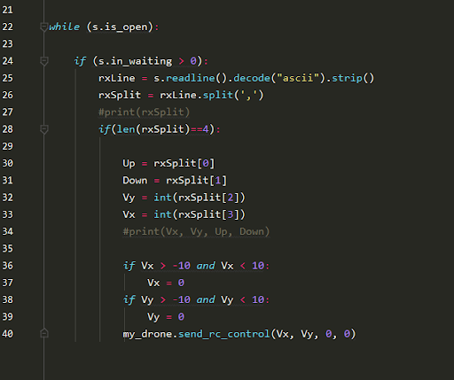

# Informatik-logbog
Logbog til informatik af David Henning Bach

## Makerspace - 3d print

- Vi skulle downloade fusion, og lave 3 simple figurer.

- Ved at bruge lasercut kan vi cutte vores figurer til x antal lag.
- I makerspace kunne vi så downloade vores figurer til et minisd kort hvorefter at vi sat den til at printe i 3d printeren.

## Tello drone

##### Analyse af drone

- Vi skulle lave en analyse af tello dronen
- Blokdiagrammer, flowcharts og i en 3-lags model med præsentationslaget, logiklaget og datalaget

##### Drone kontroller

- Startede med at opstille brainstorm, flowchart og blokdiagram
- Vi satte en jobliste op og begyndte at skrive koden
- Vi satte en arduino med et joystick op
- Efter satte vi et breadboard op med en knap
- Koden blev skrevet i c++ i Arduino IDE'en, denne kode ville tage imod inputs fra knappen og joysticket og give os et input
- Dette input ville vi så senere kunne bruge til at styre dronen

- Nu skrev vi kode i python(pycharm), som kunne tage imod et serial print fra c++(arduino) og give os et output i python 
- Vi satte en brugerundersøgelse op for vores controller
- Til denne brugerundersøgelse brugte vi 
[Gestalt lovene](http://informatik-gym.dk/glossary/gestaltlove/)

Gestalt lovene er en række love opstilliet til interraktiondesign. 
Disse love beskriver hvordan at vi opfatter elementer i et design.
Lovene er altså med til at gøre det nemmere for brugeren at forstå og bruge it-systemerne.

- Til vores kontroller havde vi valgt at gøre det modsatte af gestalt lovene
- f.eks. til punkt 1(Nærhed) valgte at sige at vi ville sætte vores joystick og knap så langt fra hinanden på et stort stykke træ

- Vi skrev python koden færdig, så den tog vores output fra vores joystick og ændrede intervallet
- Efter at vi så connectede til en tello drone via. wifi, kunne vi så give den kommandoer

Vi nåede dog ikke at blive færdig med emnet og vores kontroller pga. corona, da vi skal blive hjemme og at det ikke er muligt at arbejde med den digitalt.
Det vi manglede at lave til vores kontroller var:

  1. Finpuds kode, så at dronen var mere stabil
  2. Selve kontrolleren, atlså det stykke træ hvor at vi ville sætte vores joystick og knapper på
  3. Brugerundersøgelse

## Privathed, sikkerhed og passwords

- Vi så "Snowden", en film der handler om Edward Snowden og overvågning

- Vi læste om [sikkerhed på nettet](https://informatik.systime.dk/?id=528) og snakkede om det på klassen

Bla. snakkede vi om hashing hvorpå at dit password bliver hashet så at man ikke kan knække password så nemt.
Der er også programmer som lastpass, som laver og gemmer passwords så at de er MEGET sværere at knække og på den måde er man mere sikker.
- Filsikkerhed

| Almindelige     | Følsomme          |
|-----------------|-------------------|
| Navn            | Biometriske data  |
| Adresse         | Race              |
| Fødselsdagsdato | Etnisk oprindelse |
| Arbejdsforhold  | Religion          |
| Gæld            | Seksuelle forhold |
| Økonomi         |                   |

- persona og minervamodel til projekt formidling i programmering

## Reklamespil

- Persona og målgrupper til reklame i spil og på hjemmeside
- Data om login ville kunne blive gemt og hashet og senere brugt

## WSL 

- Mad hacker vibes
- Det virker ikke...
- https og php for at lave en hjemmesiden med serveren
- Mariadb for database
- https://phoenixnap.com/kb/how-to-create-mariadb-user-grant-privileges
- Php for at ændre html koden

- liste over linus kommandoer

| WSL kommandoer | funktionalitet                                                     |
|----------------|--------------------------------------------------------------------|
| cd             | kan bruges til at navigere mellem mapper                           |
| Sudo           | kan bruges til at få admin adgang                                  |
| Nano           | bruges til at åbne filer                                           |
| Rm             | fjern filer                                                        |
| ls             | se filer (ls -a for at se gemte filer)                             |
| ssh            | ved hjælp af public og private key kan man lave en sikker password |
| pwd            | printer det direktory du er i                                      |
| echo           | laver nye filer                                                    |
| scp            | flyt filer sikkert                                                 |

## Robot og microbit

- microbit og maqueen robot
- epic kode der er dumt

https://docs.google.com/document/d/1GMNKViDHGafB-zuGQezZl9T4QOaVq8BPRBDudMObXTQ/edit#

| Sensor/outputs       | Funktionalitet/output                                                                                         |
|----------------------|--------------------------------------------------------------------------------------------------------|
| Gyroskop             | En sensor der kan checke om robotten bliver rystet eller om den vender en bestemt vej                  |
| Ultralydsensor       | Sensor der checker distancen foran robotten ved at sende ultralyd ud og måle tiden det tager           |
| Lyssensor            | Lyscensor der sidder under robotten og ser om det robotten kører over er mørkt eller lyst              |
| Kompas               | Et kompas der sidder i robotten (virker dog ikke så godt da den sidder ved 2 batterier)                |
| Mikrofon/højtaler    | En højtaler der kan spille lyd og mikrofon der kan optage lyd                                          |
| Lys til lyssensor xD | 2 sensorere der viser om en af lyssensorene er tændt, da de sidder under og er svære at aflæse         |
| Accelerometer/magnetometer        | En sensor der kan måle acceleration og den sensor som bliver brugt til at bestemme farten for robotten |
| Radio                | Radio der kan modtage og sende signaler, ved at bruge 2 microbit kan man sende signaler via. radien fra den ene til den anden |

##### Ultralydssensor
måler distance ved at sende lyd ud.
D = V * T
Ved at vide hastigheden for lyd og ved at måle hvor lang tid det tager for lyden at komme tilbage kan man regne distancen.

##### Latch
I motoren er der en latch der virker med en 1-bit memory(2 NOR gates) der gemmer kommando fra microbit’en og vil derfor virke hvis man fjerne microbit’en fra robotten.

##### fejlkilder idk
- Hjulene er ikke kalibreret 
- Når man arbejder med elektronik er der altid en form for delay da det er umuligt for elektronik at multitaske

##### Radio
Radio transmit fra microbit til robotten
Disse beskeder bliver sat i en kø og derefter udført af microbit’en der sidder i robotten. Køen’s størrelse bliver bestemt af RAM og hvis der ikke er flere RAM tilbage bliver beskederne ikke tilført til køen. I V1 microbit er der 16 KB RAM og i V2 er der 125 KB RAM.
Radio’en virker ved at begge microbit’er bruger en kanal (0-83) og kan kun sende/modtage beskeder på den kanal. 

- En robot sammensat af en robot af maqueen med motore der kører via. 3 batterier med en masse sensorere på(se afsnit overpå), og en microbit der kan programmeres via. blokprogrammering, java og python
- 

