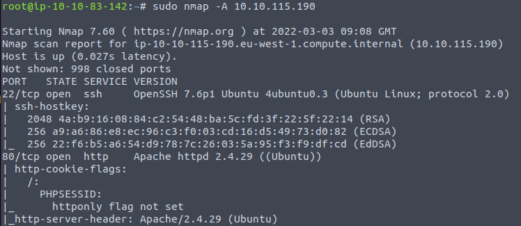
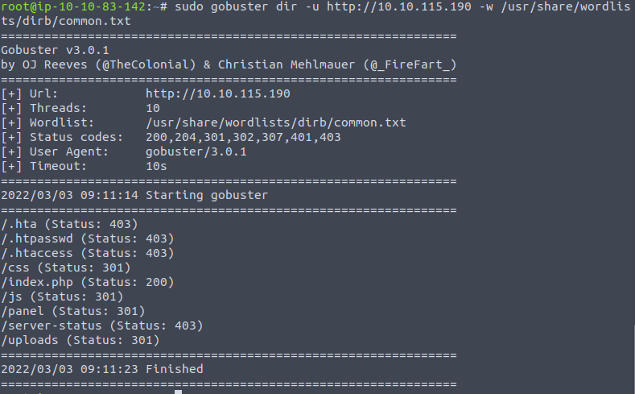
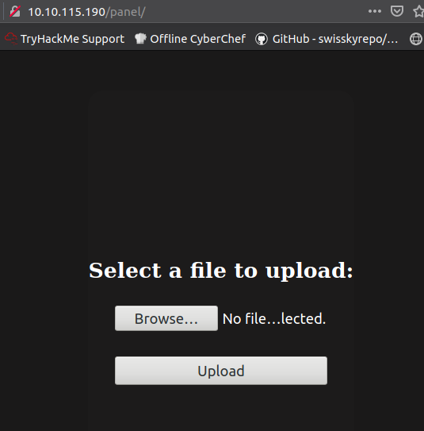

# Informatik-logbog
Logbog til informatik af David Henning Bach

## Makerspace - 3d print

- Vi skulle downloade fusion, og lave 3 simple figurer.

- Ved at bruge lasercut kan vi cutte vores figurer til x antal lag.
- I makerspace kunne vi så downloade vores figurer til et minisd kort hvorefter at vi sat den til at printe i 3d printeren.

## Tello drone

##### Analyse af drone

- Vi skulle lave en analyse af tello dronen
- Blokdiagrammer, flowcharts og i en 3-lags model med præsentationslaget, logiklaget og datalaget

##### Drone kontroller

- Startede med at opstille brainstorm, flowchart og blokdiagram
- Vi satte en jobliste op og begyndte at skrive koden
- Vi satte en arduino med et joystick op
- Efter satte vi et breadboard op med en knap
- Koden blev skrevet i c++ i Arduino IDE'en, denne kode ville tage imod inputs fra knappen og joysticket og give os et input
- Dette input ville vi så senere kunne bruge til at styre dronen

- Nu skrev vi kode i python(pycharm), som kunne tage imod et serial print fra c++(arduino) og give os et output i python 
- Vi satte en brugerundersøgelse op for vores controller
- Til denne brugerundersøgelse brugte vi 
[Gestalt lovene](http://informatik-gym.dk/glossary/gestaltlove/)

Gestalt lovene er en række love opstilliet til interraktiondesign. 
Disse love beskriver hvordan at vi opfatter elementer i et design.
Lovene er altså med til at gøre det nemmere for brugeren at forstå og bruge it-systemerne.

- Til vores kontroller havde vi valgt at gøre det modsatte af gestalt lovene
- f.eks. til punkt 1(Nærhed) valgte at sige at vi ville sætte vores joystick og knap så langt fra hinanden på et stort stykke træ

- Vi skrev python koden færdig, så den tog vores output fra vores joystick og ændrede intervallet
- Efter at vi så connectede til en tello drone via. wifi, kunne vi så give den kommandoer

Vi nåede dog ikke at blive færdig med emnet og vores kontroller pga. corona, da vi skal blive hjemme og at det ikke er muligt at arbejde med den digitalt.
Det vi manglede at lave til vores kontroller var:

  1. Finpuds kode, så at dronen var mere stabil
  2. Selve kontrolleren, atlså det stykke træ hvor at vi ville sætte vores joystick og knapper på
  3. Brugerundersøgelse

## Privathed, sikkerhed og passwords

- Vi så "Snowden", en film der handler om Edward Snowden og overvågning

- Vi læste om [sikkerhed på nettet](https://informatik.systime.dk/?id=528) og snakkede om det på klassen

Bla. snakkede vi om hashing hvorpå at dit password bliver hashet så at man ikke kan knække password så nemt.
Der er også programmer som lastpass, som laver og gemmer passwords så at de er MEGET sværere at knække og på den måde er man mere sikker.
- Filsikkerhed

| Almindelige     | Følsomme          |
|-----------------|-------------------|
| Navn            | Biometriske data  |
| Adresse         | Race              |
| Fødselsdagsdato | Etnisk oprindelse |
| Arbejdsforhold  | Religion          |
| Gæld            | Seksuelle forhold |
| Økonomi         |                   |

- persona og minervamodel til projekt formidling i programmering

## Reklamespil

- Persona og målgrupper til reklame i spil og på hjemmeside
- Data om login ville kunne blive gemt og hashet og senere brugt

## WSL 

- Mad hacker vibes
- Det virker ikke...
- https og php for at lave en hjemmesiden med serveren
- Mariadb for database
- https://phoenixnap.com/kb/how-to-create-mariadb-user-grant-privileges
- Php for at ændre html koden

- liste over linus kommandoer

| WSL kommandoer | funktionalitet                                                     |
|----------------|--------------------------------------------------------------------|
| cd             | kan bruges til at navigere mellem mapper                           |
| Sudo           | kan bruges til at få admin adgang                                  |
| Nano           | bruges til at åbne filer                                           |
| Rm             | fjern filer                                                        |
| ls             | se filer (ls -a for at se gemte filer)                             |
| ssh            | ved hjælp af public og private key kan man lave en sikker password |
| pwd            | printer det direktory du er i                                      |
| echo           | laver nye filer                                                    |
| scp            | flyt filer sikkert                                                 |

## Robot og microbit

- microbit og maqueen robot
- epic kode der er dumt

https://docs.google.com/document/d/1GMNKViDHGafB-zuGQezZl9T4QOaVq8BPRBDudMObXTQ/edit#

| Sensor/outputs       | Funktionalitet/output                                                                                         |
|----------------------|--------------------------------------------------------------------------------------------------------|
| Gyroskop             | En sensor der kan checke om robotten bliver rystet eller om den vender en bestemt vej                  |
| Ultralydsensor       | Sensor der checker distancen foran robotten ved at sende ultralyd ud og måle tiden det tager           |
| Lyssensor            | Lyscensor der sidder under robotten og ser om det robotten kører over er mørkt eller lyst              |
| Kompas               | Et kompas der sidder i robotten (virker dog ikke så godt da den sidder ved 2 batterier)                |
| Mikrofon/højtaler    | En højtaler der kan spille lyd og mikrofon der kan optage lyd                                          |
| Lys til lyssensor xD | 2 sensorere der viser om en af lyssensorene er tændt, da de sidder under og er svære at aflæse         |
| Accelerometer/magnetometer        | En sensor der kan måle acceleration og den sensor som bliver brugt til at bestemme farten for robotten |
| Radio                | Radio der kan modtage og sende signaler, ved at bruge 2 microbit kan man sende signaler via. radien fra den ene til den anden |

##### Ultralydssensor
måler distance ved at sende lyd ud.
D = V * T
Ved at vide hastigheden for lyd og ved at måle hvor lang tid det tager for lyden at komme tilbage kan man regne distancen.

##### Latch
I motoren er der en latch der virker med en 1-bit memory(2 NOR gates) der gemmer kommando fra microbit’en og vil derfor virke hvis man fjerne microbit’en fra robotten.

##### fejlkilder idk
- Hjulene er ikke kalibreret 
- Når man arbejder med elektronik er der altid en form for delay da det er umuligt for elektronik at multitaske

##### Radio
Radio transmit fra microbit til robotten
Disse beskeder bliver sat i en kø og derefter udført af microbit’en der sidder i robotten. Køen’s størrelse bliver bestemt af RAM og hvis der ikke er flere RAM tilbage bliver beskederne ikke tilført til køen. I V1 microbit er der 16 KB RAM og i V2 er der 125 KB RAM.
Radio’en virker ved at begge microbit’er bruger en kanal (0-83) og kan kun sende/modtage beskeder på den kanal. 

- En robot sammensat af en robot af maqueen med motore der kører via. 3 batterier med en masse sensorere på(se afsnit overpå), og en microbit der kan programmeres via. blokprogrammering, java og python
- 

## cybersecurity
#### epic hacker mode initialised ctf tryhackme

Prøv at få root access ig et user/root flag i en vvirtuel maskine

sudo nmap -A "ip_addessen" 
for at få alle de porte som bliver brugt atm

gobuster dir -u http://10.10.177.208 -w /usr/share/wordlists/dirb/common.txt
For at se alle de directories der er på webserveren

Her kan vi så se at der er en uploads og en panel directory hvor vi kan uploade ting

Dette kan vi bruge til at uploade en reverse shell der får computeren til at connecte til min istedet for at skulle gøre det omvendt

####### opgavertilcybermesterskab
jakobs hus, more like find the password do the root very easily

  * infosec --> information security ---> hvad information er tilgængeligt, hvordan skal det bruges og hvordn kan vi opbevare det sikkert
  * opsec --> operational secutiry
  * Ctf --> find et "user flag" i et system/hack dig ind i systemet og få adgang til disse filer
  * Enumeration --> find hvilke "numre" systemet har --> porte og ip-adresse --> tools: nmap, dirb, gobuster, shodan, exploit db, 
  * privilege escalation --> hæve priviledge på et system -->   --> gtfobins
  * writeup --> en logbog af hvordan man har båret sig af med at "hacke" noget
  * rat --> remote access trojan --> et program som får adminstrateradgang som ikke er helt sikkert
  * botnet --> en bot(en comptuter du har control over) som bliver brugt til maskinkræft til at brute force noget. 

##### hattefarver
  * Sort hat --> bad and hack stuff and blackmail
  * Grå hat --> good but kinda skethcy
  * Hvid hat --> good and use for safety

#### linus
  * kali linus
  * ubunto
  * alma linus
  * git bash(bad)

### HacktheBxo

## FTP
* Ftp er file transer så ved at logge ind med "anonymous" kan du tranfer filer fra systemet til din egen pc

## SMB
* SMB er ligesom ftp en filetranser (fra microsoft) og med "smbclient" kan du tale med det

Opgaverne er udarbejdet i et samarbejde mellem David og Jacob
Crocodile WriteUp:
Vi starter med at have fået givet en Ip.
Her starter vi så med at nmap denne ip for at se hvilke porte der er på den.
Her får vi en HTTP som siger at den her en hjemmeside, derudover får vi også en FTP, som man kan bruge til at overføre filer.
Nu prøver at logge på FTP som anonym for hente de filer der ligger på serveren, herfra kan vi gå ind og se bruger samt adgangskoder
Så brugte vi goburster til at lede efter en php fil, hvor vi så fandt login, så kunne vi åbne hjemme/login, da vi tidligere bruge FTP til at finde users og passwords kunne vi logge ind som og der lå flaget.

Appointment WriteUp:
Vi med at nmap ip for at finde eventuelle porte(http så der er en hjemmeside), herefter brugte vi goburster til at finde adresserne på hjemmesiden, her var der en login side, og efter at have prøvet at brute force den med nogle mest brugte usernames og passwd prøvede vi at lave SQL injection

Her kan der ses at vi kan bi pass adgangskoden hvis vi bruger “ ‘# “, det kan du også se i php koden hvor at username stopper med et ‘ og da vi så bruger et “#” bliver den næste del af koden(altså password delen) ligegyldigt da det bliver til en kommentar.

* Sequel opgave (Lavet med Casper:
     * nmap {target_ip}
       Får åbne porte og versioner.
     * sudo apt-get update && sudo apt-get install MySQL
       Kun hvis det ikke allerede er installeret eller opdateret
     * mysql -h {target_ip} -u root
     * SHOW DATABASES;
     * USE htb;
     * SHOW tables;
     * SELECT * FROM config;
       Herunder ligger flaget

 * Oopsie opgave (Lavet med Casper)
   * nmap {target_ip}
   * gobuster dir -u {target_ip} -w wordlist
   * sudo apt update && sudo apt install burb
   * Stuck her so far da vi ikke kunne komme ind på services på kalilinux
   * 
 * Vaccine (Lavet med Casper)
   * nmap {target_ip}
     Finder ftp
   * ftp {target_ip}
   * ls -a
   * john -h
   * zip2john backup.zip > hashes
   * ls
   * cat hashes
   * zip2john backup.zip
   * john -wordlist=/usr/share/wordlists/rockyou.txt.gz hashes
     Filen skal extractes da det ikke er rockyou.txt
   * john -wordlist=Documents/rockyou.txt hashes
     Extractede den bare til documents
   * john --show hashes
   * unzip backup.zip
   * Læser det hashede password i index.php
   * echo 'password' hash
     
  hackthebox penetration teset gik mest ud på at finde ud af hvor der var et "hul" altså et sted i systemet hvor der var nogle der havde slacket lidt så vi kunne få adgang til det
  
### Enumeration 
Enumeration er udvindingen af data fra et system som senere kan bruges til at få adgang til systemet, dette kan fx. være gennem nmap, gobuster, dirb osv. hvor vi fx. får data omkring hvilke porte der er åbne, hvilket kan bruges til at få adgang til systemet
Enumerations defination er at liste nogle ting, hvilket i cybersikkerhed oversættes til at man undersøger muligeder fejl i sikkerheden og skriver dem i en liste

### Foothold
ET foothold, er noget man kan have når man fx. har fået adgang til et system, eller har redskaberne men ikke gør noget ved det. Definationen af det foothold er også "a secure position from which further progress may be made." Det kan oogså gøres ved at få instaleret en backdoor som hackeren kun har adgang til og som er gemt i systemet.

### Escalation
Escalation er når man exploiter, fejl, gamle versioner af programmer osv. for at få adgang til et system og få flere privilegier end der var ment. "privilege escalation" altså en forced eskalation af ens privilegier i et system

# Kryptologi

# More Drone but this time, its aggresive af and attacks people
Ansigstgenkendelse genneN opencv2 cascadeS

- Cascade er en mange trins proccesing model der bruges til genkendelse af features, og til sidst kan give et gæt på om det er f.eks. et ansigt.

https://docs.google.com/document/d/1alEGACIcDYPjeVxL-pGo6v10ofqC8zreBaNR_n9iSqk/edit?usp=sharing

## Threading
For at få dronen til at både optage/calculate matematikken til asigtgenekendelse og for at flyvev, skal det gøres på flere threads
Instruktioner kan udføres parallelt på en tråd sammen med andre tråde og kan derfor bruges til at få flere instruktioner til at køre på samme tid.

# Lidt om gates

 - Gates bliver brugt sammen med transsistore og laver computere ez :)
 - Ved hjælp af and,nand,or,nor, xor, xnor gates osv. er byggestenene til alle computere 
AND-gate truth table

| A                    | B | Output                                                                                                 |
|----------------------|---|--------------------------------------------------------------------------------------------------------|
| 0                    | 1 | 0                                                                                                      |
| 0                    | 0 | 1                                                                                                      |
| 1                    | 0 | 0                                                                                                      |
| 1                    | 1 | 1                                                                                                      |

